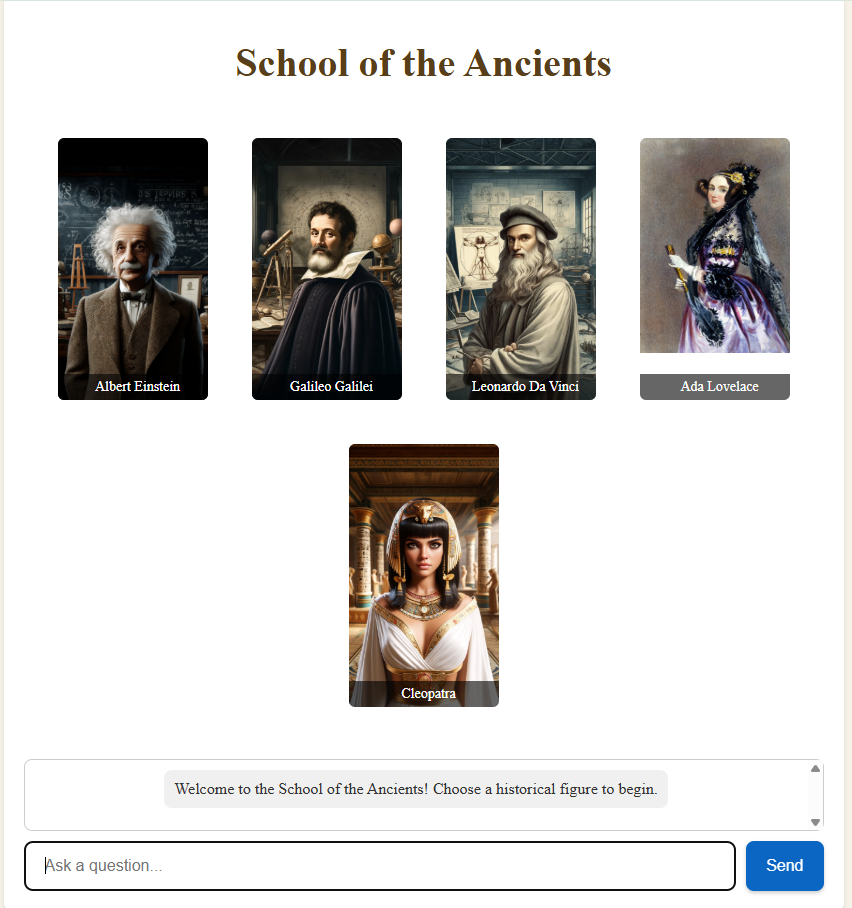

# School of the Ancients (Web)

**Talk with history’s greatest minds — web prototype (2024).**

---

## Overview
*School of the Ancients* is a web experience where you choose a historical figure (e.g., Cleopatra, Galileo, Leonardo da Vinci) and ask questions. It began as a 2020 idea inspired by **Cosmos: Seven Wonders of the New World**, was prototyped for the **Google Gemini API Developer Competition (2024)**, and later evolved into a VR world (2025).

---

## Live / Dev Links
- GitHub repo (web): https://github.com/thetopham/schooloftheancients  
- Firebase Console (project): https://studio.firebase.google.com/schooloftheancients-6291456  
- Cloud Workstations (dev): https://9000-idx-schooloftheancients-1716278013162.cluster-rhptpnrfenhe4qarq36djxjqmg.cloudworkstations.dev/

> Note: Some links may require access.

---

## Features
- Gallery of historical figures (cards) with portraits and bios  
- Prompted Q&A (sample questions per figure)  
- Simple chat UI with “Ask a question…” input  
- Firebase hosting/data + Google APIs

---

## Tech Stack
- **Frontend:** HTML/CSS/JS (or React, if applicable)  
- **Backend / Services:** Firebase, Google APIs  
- **AI:** Gemini API (competition prototype)

---

## Quick Start
```bash
# clone
git clone https://github.com/thetopham/schooloftheancients.git
cd schooloftheancients

# install (if using npm)
npm install

# set env (Firebase keys, Gemini, etc.)
# .env.example -> .env and fill in values

# run locally (adjust if using Vite/React/etc.)
npm run dev
